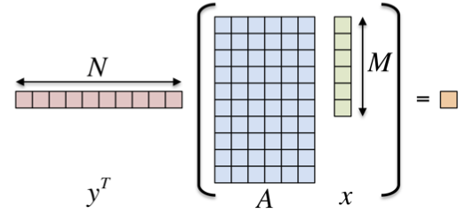

# Introduction to Kokkos

This lab will introduce the Kokkos framework for portable performance.

This mainly follows the training given at SC 2017 and is also
available from
[their GitHub](https://github.com/kokkos/kokkos-tutorials/blob/master/Intro-Short/Slides/KokkosTutorial_SC17.pdf).

__Note__: you should use these build instructions instead of the ones
in the slides.

The files for this are on [the course repository](https://github.com/EPCCed/2019-08-27-ModernCpp/).

To check out the repository run:

```bash
git clone https://github.com/EPCCed/2019-08-27-ModernCpp/
cd 2019-08-27-ModernCpp/exercies/kokkos
```

## Problem: Inner product

We will be looking at the inner product:



where x and y are vectors and A is a matrix.

## Cirrus
Please ensure you are logged into the node login0.

Load required modules:
```
module load gcc cuda kokkos
```

## Plots

We have provided a Jupyter notebook for creating plots of the
performance: [plot.ipynb](plot.ipynb).

You can run this on your laptop if you have Jupyter installed or on
Cirrus, connecting your local browser via a SSH tunnel.

To run locally, simply download the notebook to your machine and run
the notebook which should open in your default browser if correctly
configured:

```
jupyter-notenook plot.ipynb
```

To run the notebook on Cirrus, run the script `run_nb_server.sh` with
two arguments: the port to listen on (must be a unique number between
1024 and 65536) and a password, e.g.
```
./run_nb_server.sh 6547 s3cret
```
The script will print further instructions.


# 1. Initialise, Use, Finalise

The corresponding source code can be found in
`2019-08-27-ModernCpp/exercies/kokkos/1/exercise_1_begin.cpp`

In short, you need to set up Kokkos by calling `Kokkos::initialize`
and `Kokkos::finalize` and convert the _outer_ loops to use the
parallel algorithms. The places where you need to change things are
marked with `EXERCISE`.

On Cirrus, you can simply compile with `make` and the executable will
then use OpenMP to parallelise the loops across available cores.
While you *can* run on the login node for the OpenMP and serial
backends, please submit to the queue. An example job script is
`submit.sh`. Please ensure you set the number of threads to less than
or equal to the number of cores you request in the job script!

When you run you can set the problem size with command line
flags. These are passed as a power of 2 (e.g. `10 => 2**10 = 1024`).

* `-N` - the number of rows (default = 12)
* `-M` - the number of columns (default = 10)
* `-S` - the total size (default = 22, must equal sum of M and N)

Can also specify the number of repeats:
* `-nrepeat` (default = 100)

When using OpenMP, specify the number of threads to use by setting the
`OMP_NUM_THREADS` environment variable, e.g.:
```
export OMP_NUM_THREADS=1
./01_Exercise.OpenMP -N 12
```
Or instead use the command line argument `--kokkos-threads=n`. You can
also use the option `--kokkos-numa=2` if you run across the two
sockets on nodes.

Things to look at:

* vary problem size
* vary number of cores
* compare Skylake Gold (GPU nodes) vs Broadwell (regular nodes)

# 2. Use Views

The corresponding source code is in
`2019-08-27-ModernCpp/exercies/kokkos/2/exercise_2_begin.cpp`.

In this part, you change the data storage from raw arrays to
`Kokkos::View` instantiations. The `View` template class provides
access to elements via `operator()` to allow multidimensional indexing
and thus encapsulation of the actual layout of data.

Note: we are forcing Kokkos use to unified memory for the CUDA build
so you do not need to use mirror views (yet!).

Compile with `make` and run the code on the CPU with OpenMP and on the
GPU with CUDA + UVM - see the example submission script for
details. Compare the performance you get for the CPU to the GPU for a
range of problem sizes.

You can plot results with the plotting notebook explained above.

# 3. Use Mirror Views

The corresponding source code is in
`2019-08-27-ModernCpp/exercies/kokkos/3/exercise_3_begin.cpp`.

Here we add `HostMirror` instances to manage transfer of data between
host and GPU memories. Search the source for comments saying
`EXERCISE` to see where to change things.

Note that we are no longer forcing CUDA to use Unified Memory.

Compile with make and run the code on a GPU node - see `submit.sh` for
example use. Again, compare performance between CPU and GPU for a
range of problem sizes.


# 4. Control the Layout

The corresponding source code is in
`2019-08-27-ModernCpp/exercies/kokkos/4/exercise_4_begin.cpp`.

Here you will control the layout of the data and experiment with the
combinations of the execution space and data layout.  Search the
source for comments saying `EXERCISE` to see where to change things.

Compile for a variety of memory layouts and execution spaces and run
across a range of problem sizes. Plot the results and try to
understand the variation.
