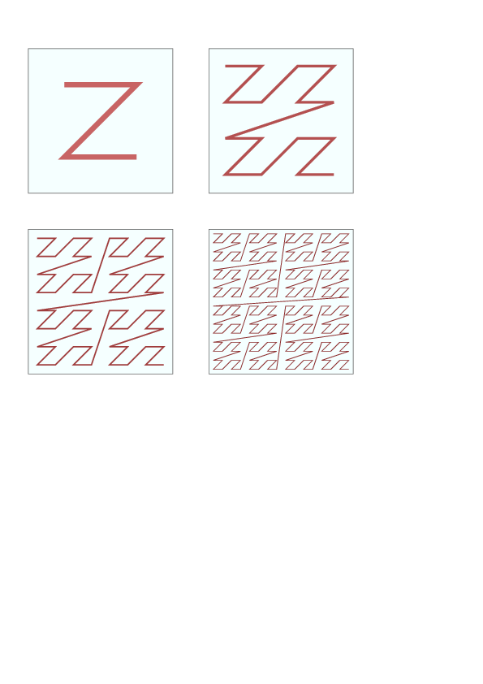

# Morton order matrices in C++
## Rupert Nash
## r.nash@epcc.ed.ac.uk

Source for this can be obtained from Github. Get a new copy with:

```
git clone https://github.com/EPCCed/cpp4hpc
```

or update your existing one with

```
git pull
```

then you can

```
cd cpp4hpc/exercises/morton-order
```

The Morton ordering (or z-ordering) of a matrix lays out the elements
along a recursive z-shaped curve, as shown in the figure of four
iterations of the Z-order curve (from
[Wikipedia](https://en.wikipedia.org/wiki/Z-order_curve)).



You can compute the Morton index `z` from the x- and y-indices (`i`
and `j` respectively) by interleaving their bits. An example is shown
in the table.

|    |  0 |  1 |  2 |  3 |
|----|----|----|----|----|
| 0  |   0|   1|   4|   6|
| 1  |   2|   3|   5|   7|
| 2  |   8|   9|  12|  13|
| 3  |  10|  11|  14|  15|

Mapping between `x-y` indexes and Morton index for a 4 by 4
matrix. Decimal on the left and binary on the right.

|    |   00 |   01 |   10 |  11 |
|----|------|------|------|-----|
| 00 | 0000 | 0001 | 0100 | 0101|
| 01 | 0010 | 0011 | 0110 | 0111|
| 10 | 1000 | 1001 | 1100 | 1101|
| 11 | 1010 | 1011 | 1110 | 1111|

Mapping between `x-y` indexes and Morton index for a matrix of size 
4-by-4. Decimal on the left and binary on the right.

The advantage of laying out data in this way is that it improves data
locality (and hence cache use) without having to tune a block size or
similar parameter. On a modern multilevel cache machine[^1], this
means it can take good advantage of all the levels without tuning
multiple parameters.

(E.g. an ARCHER node has L1, L2, and L3 caches, and the RAM is divided
into two NUMA regions. If using a PGAS approach one can view local RAM
as a cache for the distributed memory - i.e. 6 levels!)

This exercise will walk you through a simple implementation.

I have included implementations of the functions that do the
"bit-twiddling" for translating between a two-dimensional `x-y` index
and the Morton index, in the file `bits.hpp`. These are reasonably fast,
but can be beaten if you are interested to try!

In what follows each section corresponds to a subdirectory with the same
number.

## Implement the underlying data storage and element access

Go to the step 1 directory:

```bash
cd  cpp4hpc/exercises/morton-order/step1
```

Using the partial implemenation in `matrix.hpp`, your task is to
implement the allocation (and release!) of memory to store the data and
to use the helper functions from `bits.hpp` to allow element access. You
will need to implement a number of member functions (marked in the
source with `\\ TODO`) and add whatever data members are needed (marked in
the same way).

There is a test program `test_matrix_basic.cpp` which runs a few sanity
checks on your implementation (and similarly with `test_bits.cpp`). The
supplied `Makefile` should work.

## Implement a basic iterator to traverse the matrix in order

Go to the step 2 directory:

```bash 
cd  cpp4hpc/exercises/morton-order/step2
```

I have a potential solution to part 1 here, but feel free to copy your
implementation into this.

The exercise here is to complete the `matrix_iterator` class template
that I have started. I've provided most of the boilerplate to have
this work as a "bidirectional iterator". See
http://en.cppreference.com/w/cpp/concept/BidirectionalIterator for
full details of what this means, but basically it's one that can move
forward and backward through the data.

Again, the things that need added are marked with `\\TODO`. The most
important thing to think about is how you will refer to the current
position and be able to traverse through it efficiently in Morton
order - the performance should be identical to looping over a raw
pointer!


