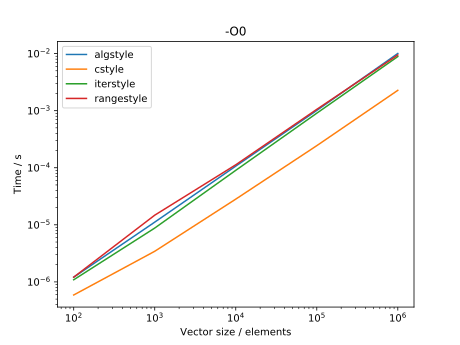
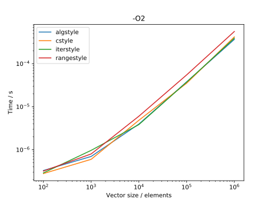

template: titleslide

# Algorithms, lambdas, traits
## Rupert Nash
## r.nash@epcc.ed.ac.uk

---

template: titleslide
# Recap
---

# Iterators
```C++
std::vector<double> data = GetData(n);

// C style iteration - fully explicit
for (auto i=0; i != n; ++i) {
  data[i] *= 2;
}
// Old C++ style - hides some details
for (auto iter = data.begin(); iter != data.end(); ++iter) {
  *iter *= 2;
}
// New range-based for
for (auto& item : data) {
  item *= 2;
}
```

---
template: titleslide
# Standard algorithms library
---

# Standard algorithms library

The library includes many (around 100) function templates that
implement algorithms, like "count the elements that match a criteria",
or "divide the elements based on a condition".

These all use *iterators* to specify the data they will work on, e.g.,
`count` might use a vector's `begin()` and `end()` iterators.

```C++
#include <algorithm>
std::vector<int> data = Read();
int nzeros = std::count(data.begin(), data.end(),
						0);

bool is_prime(int x);
int nprimes = std::count_if(data.begin(), data.end(),
							is_prime);
```
---
# Standard algorithms library

Possible implementation:
```C++
template<class InputIt, class UnaryPredicate>
intptr_t count_if(InputIt first, InputIt last,
				  UnaryPredicate p) {
  intptr_t ans = 0;
  for (; first != last; ++first) {
	if (p(*first)) {
	  ans++;
	}
  }
  return ans;
}
```

(Unary `\(\implies\)` one argument, a predicate is a Boolean-valued
function.)

---

# Key algorithms

|Algorithm | Description |
|--|---|
| `for_each` | Apply function to each element in the range. |
| `count`/`count_if`| Return number of elements matching.
| `find`/`find_if` | Return iterator to first element matching or end if no match. |
| `copy`/`copy_if` | Copy input range (if predicate true) to destination |
| `transform` | Apply the function to input elements storing in destination (has overload work on two inputs at once) |
| `swap` | Swap two values - used widely! You may wish to provide a way to make your types swappable (see cpprefence.com) |
| `sort` | Sort elements in ascending order using either `operator<` or the binary predicate provided |
| `lower_bound`/ `upper_bound` | Given a *sorted* range, do a binary search for value. |

---

# `for_each`

One of the simplest algorithms: apply a function to every element in a
range.
```C++
template< class InputIt, class UnaryFunction >
UnaryFunction for_each(InputIt first,
					   InputIt last,
					   UnaryFunction f);
```
					   
Why bother?

-   Clearly states your intent

-   Cannot get an off-by-one errors / skip elements

-   Works well with other range-based algorithms

-   Concise if your operation is already defined in a function

However often a range-based for loop is better!

---
# `transform`

A very powerful function with two variants: one takes a single range,
applies a function to each element, and stores the result in an output
iterator.
```C++
template<class InputIt, class OutputIt,
		 class UnaryOperation >
OutputIt transform(InputIt first1, InputIt last1,
				   OutputIt d_first,
				   UnaryOperation unary_op );
```

This is basically the equivalent of `map` from functional programming or MapReduce.

```C++
std::vector<float> data = GetData();
std::transform(data.begin(), data.end(),
			   data.begin(), double_in_place);
```

You can use your input as the output.

---

# Motivation

Implementations have been written *and tested* by your compiler
authors.

The library may be able to do platform-specific optimizations that you
probably don't want to maintain.

They form a language to communicate with other programmers what your
code is really doing.

It's nice code that you don't have to write.

```C++
for (auto it = images.begin();
	 it != images.end(); ++it) {
  if (ContainsCat(*it)) {
	catpics.push_back(*it);
  }
}
```
vs
```C++
std::copy_if(images.begin(), images.end(),
			 ContainsCat, std::back_inserter(catpics));
```

---
template:titleslide

# Lambda functions
---

# Algorithms need functions

Very many of the algorithms just discussed need you to provide a
function-like object as an argument for them to use.

If you have to declare a new function for a one-off use in an algorithm
call that is inconvenient and moves the code away from its use site.

Worse would be to have to create a custom function object class each
time!

---
# A verbose example

```C++
struct SquareAndAddConstF {
  float c;
  SquareAndAddConstF(float c_) : c(c_) {}
  
  float operator()(float x) {
	return x*x + c;
  }
};

std::vector<float> SquareAndAddConst(const std::vector<float>& x, float c) {
  std::vector<float> ans;
  ans.resize(x.size());
  
  std::transform(x.begin(), x.end(), ans.begin(),
	SquareAndAddConst(c));
  return ans;
}
```
---

# Lambdas to the rescue

-   A lambda function a.k.a. a closure is a function object that does
    not have a name like the functions you have seen so far.

-   You can define one inside a function body

-   You can bind them to a variable, call them and pass them to other
    functions.

-   They can capture local variables (either by value or reference).

-   They have a unique, unknown type so you may have to use `auto` or
    pass them straight to a template argument.

---

# A less verbose example
```C++
std::vector<float> SquareAndAddConst(const std::vector<float>& x, float c) {
  std::vector<float> ans;
  ans.resize(x.size());
  auto func = [c] (double z) { return z*z + c; };
  std::transform(x.begin(), x.end(), ans.begin(),
	func);
  return ans;
}
```

---

# A less less verbose example
```C++
std::vector<float> SquareAndAddConst(const std::vector<float>& x, float c) {
  std::vector<float> ans;
  ans.resize(x.size());
  std::transform(x.begin(), x.end(), ans.begin(),
	[c] (double z) { return z*z + c; });
  return ans;
}
```

---
# Anatomy of a lambda
```
[captures](arg-list) -> ret-type {function-body}
```
| |  |
|---|----|
| `[ ... ]` | new syntax that indicates this is a lambda expression |
| `arg-list` | exactly as normal |
| `function-body` | zero or more statements as normal |
| `-> ret-type` | new C++11 syntax to specify the return type of a function - can be skipped if return type is void or function body is only a single `return` statement.  |
| `captures` | zero or more comma separated captures  |


You can capture a value by copy (just put its name: `local`) or by reference
(put an ampersand before its name: `&local`).

---
# Anatomy of a lambda

```
[captures](arg-list) -> ret-type {function-body}
```

This creates a function object of a unique unnamed type  (you
must use `auto` to store it in a local variable).

You can call this like any object that overloads `operator()`:
```C++
std::cout << "3^2 +c = " << func(3) << std::endl;
```

Note that because it does not have a name, it cannot take part in
overload resolution.

---

# Quick Quiz

What does the following do?
```C++
    [](){}();
```
--

Nothing

---

# Uses

-   STL algorithms library (or similar) - pass small one-off pieces of
    code in freely

```C++
std::sort(molecules.begin(), molecules.end(),
  [](const Mol& a, const Mol& b) {
    return a.charge < b.charge;
  });
```

-   To do complex initialisation on something, especially if it should
    be `const`.

```C++
const auto rands = [&size] () -> std::vector<float> {
  std::vector<float> ans(size);
  for (auto& el: ans) {
    el = GetRandomNumber();
  }
  return ans;
  }(); // Note parens to call!
```

---
# Rules of thumb

Be careful with what you capture!


---
template: titleslide
# Performance

???

Many people are a bit concerned that using iterators/lambdas etc
incurs some overhead - after all you're calling a bunch of
functions. So let's benchmark them

---

# Many ways to iterate
```C++
// C style iteration - fully explicit
for (auto i=0; i != n; ++i) {
  data[i] *= 2;
  }
  
// Old C++ style - hides some details
for (auto iter = data.begin(); iter != data.end(); ++iter) {
  *iter *= 2;
}
  
// New range-based for
for (auto& item : data) {
  item *= 2;
}

// Algorithms library
std::for_each(data.begin(), data.end(),
			  double_in_place);
```

---
# Is there any overhead?

Going to quickly compare four implementations to scale by 0.5:

-   C-style array indexing

-   Standard vector with iterator

-   Standard vector with range based for-loop

-   Standard vector with std::for_each

```C++
int main(int argc, char** argv) {
  int size = std::atoi(argv[1]);
  std::vector<float> data(size);
  for (auto& el: data)
    el = rand(1000);
  Timer t;
  scale(data.data(), data.size(), 0.5);
  std::cout << size << ", " 
            << t.GetSeconds() << std::endl;
}
```

---
# Results
.center[]

---
# Results
.center[]

---
template: titleslide

# Traits
---

# Type traits

- Important C++ generic programming technique, used across the
    standard library

- The "if-then-else" of types

- Provide a template class that has typedefs/member functions that
    specify the configurable parts

- Your generic algorithm then uses this class, specialised on the type
    it is working on, to select behaviour

- You do not have to change the source of either the algorithm or the
    working type

---

# STL traits

Several headers contain these:

-   The header `<type_traits>` has lots of information for handling
    types. E.g. `std::is_pointer<int>::value` has value of false.

-   `std::numeric_limits<T>` gives lots of parameters for the built in
    number types, such as largest and smallest values, whether they are
    integer or floating types, etc.

Other traits are used everywhere behind the scenes for efficiency.

---

# Real example

Suppose you are writing a wrapper around MPI to allow use without
having to always say `MPI_FLOAT` - since the compiler knows the types
already!

```C++
class Comm {
public:
  template <class T>
  void send(const std::vector<T>& data,
			int dest, int tag);
};

auto& world = Mpi::CommWorld();
std::vector<int> data = {2, 4, 6, 8};

world.send(data, other_rank, tag);
```

---

# Real example

Simplified implementation:

```C++
template <class T>
void Comm::send(const std::vector<T>& data, int dest, int tag) {
  MPI_Send(reinterpret_cast<void*>(data.data()), data.size(),
		   DATATYPE,
		   dest, tag, m_comm);
}
```

--
How to fill in the right type?

For the types in the standard, we could
provide a specialisation for each one:

```C++
template <>
void Comm::send<int>(const std::vector<int>& data, int dest, int tag) {
  MPI_Send(reinterpret_cast<void*>(data.data()), data.size(),
		   MPI_INT,
		   dest, tag, m_comm);
}
```

---

# Real example

But there are lots of types (say `M`) and lots of MPI calls (say `N`)
to be wrapped, so we have to write `M * N` specialisations...

Also how to add any custom types? User would have to mess around with
our library.

---
# Real example

Create a traits class that tells our functions how to handle different
types:

```C++
template <class T>
struct DataTypeTraits {
  // Don't provide a default definition
  // (because there is no generic way to make an MPI datatype)
  static MPI_Datatype Get();
};

template <class T>
void Comm::send(const std::vector<T>& data, int dest, int tag) {
  MPI_Send(reinterpret_cast<void*>(data.data()), data.size(),
         DataTypeTraits<T>::Get(),
		 dest, tag, m_comm);
}
```

---

# Real example

Then we can then provide a specialised defintion for all the types we
can handle:

```C++
template<>
MPI_Datatype DataTypeTraits<int>::Get() {
  return MPI_INT;
}
  
template<>
MPI_Datatype DataTypeTraits<float>::Get() {
  return MPI_FLOAT;
}

// etc
```

If we try to communicate a data type we haven't specialised for, we
will get a compile time error!

