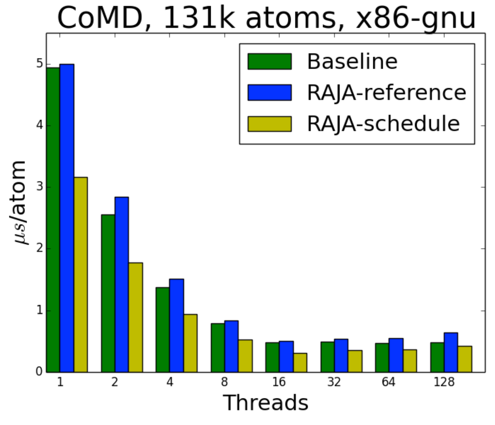
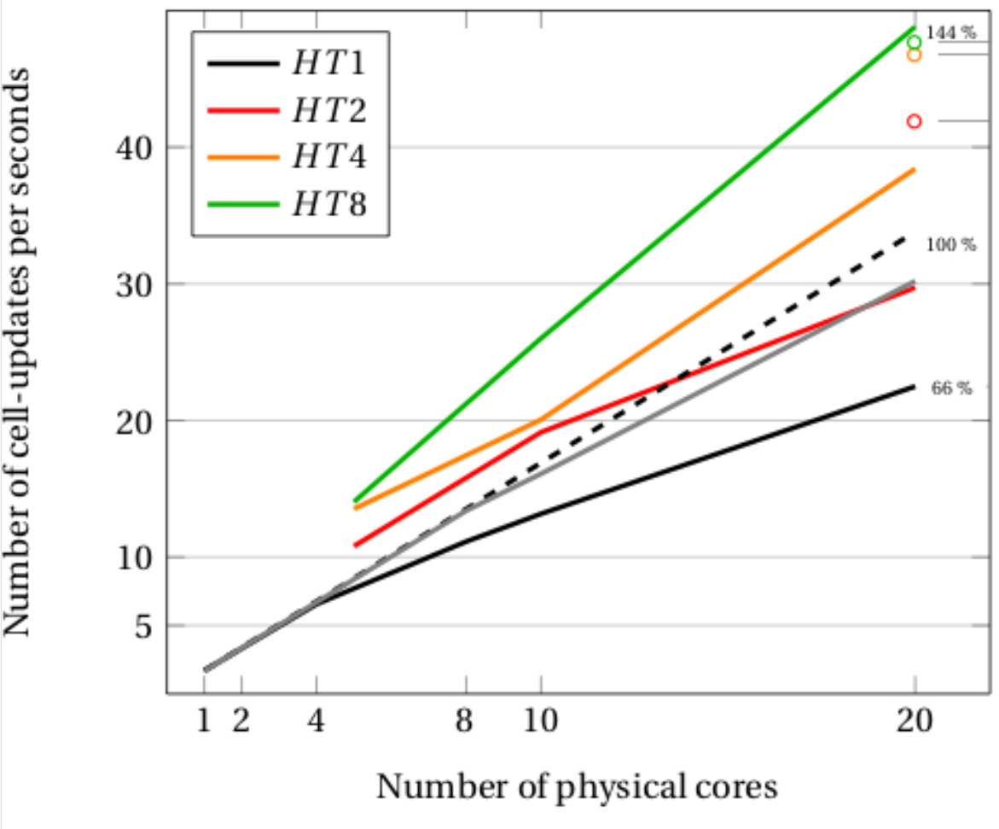
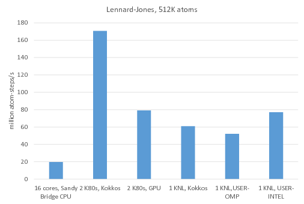
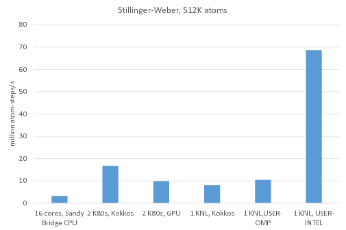

template: titleslide

# C++ frameworks for portable performance
## Rupert Nash
## r.nash@epcc.ed.ac.uk

---
template: titleslide
# Introduction

---

# Portable performance

Modern HPC systems usually have several levels of parallelism
-   Multiple nodes

-   Each with multi-core CPUs

-   Each with vector FPUs

Many have accelerators (GPUs) for offloading kernels

-   High FLOP/Watt

-   High bandwidth graphics memory.

-   Complexity of managing offloading and distinct memory spaces

---

# Portable performance

Challenge: expose algorithms' parallelism in a way that maps to
hardware, with:

-   optimal performance

-   intuitive expression of algorithm

-   portability across different systems (Pure CPU, GPU, Xeon Phi,
    future?)

-   only one version of the code base

Or at least close!

---

# What do we need to control?
.columns[
.col[
##Data

- *Where* is the data? In which memory space?

- *How* is the data laid out? Array of Structures or Structure of Arrays?
]
.col[
## Execution

- *Where* is the computation to take place?

- *How* do parts relate? `for_each`/`reduce`/etc
]
]
---

# Why not just use...

- CUDA - NVIDIA only

- OpenCL - NVIDIA, AMD, embedded GPU. CPU working, but performance not
    great - quite low-level

- OpenMP or OpenACC - Maybe eventually! Not quite flexible enough yet,
    but OpenACC really only NV/AMD and OpenMP requires different
    directives for CPU vs GPU

- Your suggestions -  ...

---

# What about parallel languages?

-   This is an area of active research! Lots have been proposed. Few
    are used outside of CS research.

-   You need to trust this has been tested and will be supported for the
    life of your application.

-   You need compiler, debugger, libraries that work with it

-   You need to learn a new language.

-   Anyone who wants to maintain/extend your code needs to learn a new
    language.

-   Using it on a new architecure may require convincing the compiler
    team to port it for you.

---

# C++ can help

Practical lab had an example of implementing a matrix template class
with Morton order data layout:

.center[]
---

# C++ can help

We have seen how the standard template library makes many algorithms
available to us in a standard way.

```C++
std::for_each(data.begin(), data.end(),
  [](double& elem) {
	elem = DoSomething();
  }
}
```

These functions are implemented in standard C++ - you could write an
equivalent.

---
# C++ can help

If `InputIt` is a random-access iterator (e.g. from a `std::vector`)
then you could use this to parallelise with OpenMP (v3 or greater)

```C++
template< class InputIt, class UnaryFunction >
void omp_for_each(InputIt first, InputIt last,
				  UnaryFunction f) {
#pragma omp parallel for
  for(InputIt iter = first;
	  iter < last; ++iter) {
	f(*iter);
  }
}
```

---

# C++ can help

You can use this as a drop-in replacement for `std::for_each`:
```C++
omp_for_each(data.begin(), data.end(),
  [](double& elem) {
	elem = DoSomething();
  });
```

But this is just one thing on one method of parallelisation - we want
more and across all levels in a node, at least.

---
# Various options

Fortunately a number of groups have done much of this work for us!

- targetDP

- Kokkos

- RAJA

- Many more that target a subset of platforms:

    - Thrust: CUDA specific containers and algorithms. Easy
        interoperability with CUDA
        <http://docs.nvidia.com/cuda/thrust/index.html>.
    - Hemi: CUDA only but hides much of the complexity of writing
        device code <https://github.com/harrism/hemi>.
    - C++AMP - Microsoft developed language extension allowing you to
        abstract the details writing code for execution on host or
        GPU.  <https://msdn.microsoft.com/en-us/library/hh265137.aspx>
    - Many more!

---

# targetDP (DP = data parallel)

-   Alan Gray's (ex-EPCC, now NVIDIA) project

-   Using C as the host language. Targets parallelism using OpenMP (CPU,
    Xeon Phi) and CUDA.

-   Data elements accessed through macros to abstract layout; data
    allocation and movement handled by simple API.

-   Parallelism expressed with two macros: `__targetTLP__` and
    `__targetILP__` for thread and instruction level parallelism
    respectively.

-   Good if you want something lightweight and are using C.

-   <https://arxiv.org/abs/1609.01479> source in LUDWIG
    <https://ccpforge.cse.rl.ac.uk/gf/project/ludwig/>

---
# RAJA From LLNL (one of the big US national labs)

C++ library that uses these concepts to achieve performance portability.

DAXPY combined with a reduction:
```C++
double* x; double* y;
RAJA::SumReduction<reduce_policy,double> sum(0.0);

RAJA::forall<exec_policy>(begin, end,
  [=] (int i) {
	y[i] += a * x[i];
	sum += y[i];
  });
```

---

#RAJA performance

.columns[
.col[
-   CoMD is a classical molecular dynamics code, written in C
    (baseline - green)

-   The RAJA authors ported it to RAJA naively (RAJA-reference - blue)
    and then optimized some parts (RAJA-schedule - yellow).

-   Better than the optimized C version! They only had to alter 2% of
    lines and now it runs on GPU too.
	]
	.col[

]]

---

# Kokkos

Features quite similar to RAJA and also a product of a US national
lab: Sandia this time.

They are much more open and have several major applications
(e.g. LAMMPS molecular dynamics code, SPARTA rarefied gas code) and
libraries (Trilinos) using Kokkos.

They are committed to supporting use of Kokkos internally and
externally.

They have a library of routines for BLAS/LAPACK/Graph manipulation and
a growing ecosystem.

---

# Kokkos simple example 1

HPC's favourite simple test, saxpy (single precision `a*x + y`)

```C++
kokkos::parallel_for(N,
  KOKKOS_LAMBDA(int i) {
	y(i) = a * x(i) + y(i);
  });
```

This will run the lambda `N` times in the "default execution space"
you have set (by default the CPU, but could easily be the GPU)

The `KOKKOS_LAMBDA` is to deal with CUDA requiring lambdas to have the
`__device__` attribute.

---

# Kokkos simple example 2

Dot product of `x` and `y`:

```C++
float result = 0;
parallel_reduce(N,
  KOKKOS_LAMBDA(int i, float& value) {
	value += x(i) * y(i);
  }, result);
```
	 
Kokkos manages each thread's local temporary values and reduces them
in a scalable way based on the execution space.

---

# Kokkos data

Kokkos uses a lightweight "View" template class to store data. It can
be considered much like a `std::shared_ptr`.

Rank (number of dimensions) is fixed at compile time

Size of array can be set at compile or run time (run time must go
first).

```C++
// 2 run, 0 compile
View<float**> d1("label", M, N);

// 1 run, 1 compile
View<float*[N]> d2("label", M);

// 0 run, 2 compile
View<float[M][N]> d3("label");
```

---

# Kokkos data

Allocation and copy only occur when explicitly specified

Copy construction and assignment are shallow.

Only when last view holding a reference destructs is the data
deallocated.

```C++
View<int[5]> a("a"), b("b");
b = a;
{
  View<int*> c(b);
  a(0) = 1; b(0) = 2; c(0) = 3;
}
std::cout << a(0);
```

What is printed?

--
3

---

# Memory spaces

Kokkos has the concept of a **memory space**. E.g.
 - main host DRAM
 - GPU memory
 - Xeon Phi HBM
 - CUDA Unified memory

You give this as a second template argument to the view:

```C++
View<double**, CudaSpace> view(M, N);
```

If you don't provide one, it will use a default suitable for your
default execution space.

---

# Memory layout

Kokkos also controls memory layout with a template parameter:

```C++
View<double**, LayoutRight, Space> CStyle(M,N); 
View<double**, LayoutLeft, Space> FortranStyle(M,N);
```

If you don't provide one, it will use the default for the memory space
(e.g. `LayoutLeft` for `CudaSpace` and `LayoutRight` for `HostSpace`).

You can define your own layouts.

---

# Mirrors and copies

A *mirror* is a view of a compatible array residing in a (possibly)
different memory space.

You must explicitly request copying with `deep_copy`.
```C++
// Create your device array
View<double*, CudaSpace> data(N);

// Create a host mirror of that
auto host_data = create_mirror_view(data);

// Populate on host
host_data = ReadFromFile();
deep_copy(data, host_data);

// Use on device
parallel_for(...);
```

---

# Some results
.columns[
.col[
- RamsesGPU is an astrophysical magnetohydrodynamics code, started in 2009, parallelised with CUDA and MPI.

- The developers have ported some parts to use Kokkos instead of CUDA.

- Without much optimization effort they see performance only 2--5% worse than their highly-tuned CUDA
]
.col[
 And better CPU-only performance:


Gray: Original code
]
]

---

# Some results
.columns[
.col[
-   LAMMPS - major open source MD code

-   Very widely used

-   Was the first major (public) code to use Kokkos

-   Most recent benchmarks from http://lammps.sandia.gov/bench.html
]
.col[
Lennard-Jones case (Higher is better)
 
]]

---
# Some results
.columns[
.col[
-   LAMMPS - major open source MD code

-   Very widely used

-   Was the first major (public) code to use Kokkos

-   Most recent benchmarks from http://lammps.sandia.gov/bench.html
]
.col[
Stillinger-Weber potential (Higher is better)



Highly tuned vendor implementations can still win!
]]
