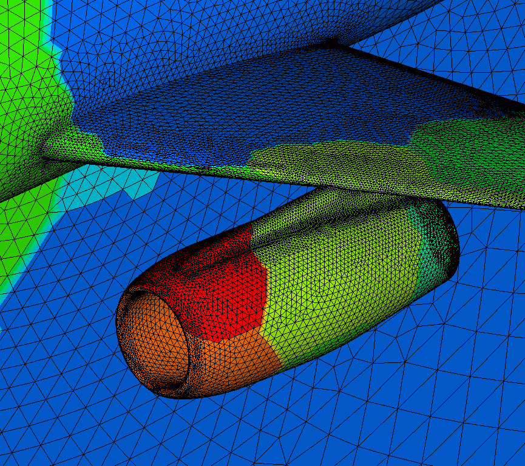

template: titleslide
# Containers, loops, and iterators
## Rupert Nash
## r.nash@epcc.ed.ac.uk

???

We've pretty much only talked about working on single things at once

Simulation/analysis usually require us to deal with many things: many
data points, many atoms in your MD simulation, etc.

---
# Containers

So we have some intuition about what this means

In C++ a container:

- Holds objects of a uniform type

- Owns the objects that it contains

- Provides access to its elements

- The sorts of access and the performance of these operations depends
  on the container

---
# Standard library containers

The standard library has 13 container template classes, but we'll only touch on a few.

-   `vector` - a dynamically sized contiguous array

-   `array` - a statically sized contiguous array

-   `list`/`forward_list` - a doubly/singly linked list

-   (`unordered_`)`set` /  (`unordered_`)`map` 

---
# vector - your new best friend

The size of the vector is determined at run time (and hence memory is
allocated then)

The elements are contiguous in memory, so it is fast to jump to any
element by index and to iterate though them.

```C++
#include <vector>
#include <iostream>

void ShowData() {
  std::vector<int> data = GetData();
  for (int x: data) {
    std::cout << x << "\n";
  }
}
```


???

Poorly named, but we're stuck: `std::vector` is not a vector in either
the 3D spatial sense nor the vector space sense...

Why does contiguous memory => fast? Because main memory is slow, chips
have caches which bring lines of memory into small high speed bits of
memory on chip. They also notice when you are running through a chunk
of memory and pre-fetch (or the compiler does this)

We put the type of the elements inside the angle brackets

Here we show a for loop that will iterate through every element of the vector

---
# vector - your new best friend

Supports:

-   copy

-   random element access by index

-   resize (and pre-reserving memory)

-   element insertion

-   element deletion

Note that when it reaches the end of its lifetime, contained elements
will also be destroyed (i.e. it *owns* them).

Also be aware that resizes may force reallocation and copying!

---
# vector building

```C++
std::vector<unsigned> first_n_primes(unsigned n) {
  std::vector<unsigned> ans;
  unsigned maybe_prime = 0;
  while (ans.size() < n) {
    if (is_prime(maybe_prime)) {
      ans.push_back(maybe_prime);
    }
    maybe_prime += 1;
  }
  return ans;
}
```
???
Default constructor creates an empty vector

`push_back` adds a new value to the end of the vector

This might require a re-allocation of memory and copying the contents -

Discuss capacity.

---
# array

-   Contiguous in memory but the size is fixed at compile time.

-   Almost like a vector, but you can't change the size.

-   Only difference is construction - list the values inside the braces

```C++
#include <array>
using GridPoint = std::array<int, 3>;

auto p1 = GridPoint{1,2,3};
std::cout << p1.size() << std::endl;
// Prints 3
```

---
# list (and forward_list)

-   Almost always implemented as a doubly (singly) linked list.

-   Elements are allocated one by one on the heap at run time.

-   Traversal requires 

-   Fast element insertion and deletion (if you don't have to look for
    the element!)


---
# set and map

-   These are associative containers implemented as sorted data
    structures for rapid search.

-   `set` is just a set of keys, `map` is a set of key/value pairs
    (types can differ).

-   You must have defined a comparison function for the key type.

-   You may want to use the `unordered` versions which use a hash table


---
# Guidelines

> Each container has its traits  
> That define the places where they are great  
> Particularly vector  
> You don't need a lecture  
> Just use vector  

> Where choosing a container, remember vector is best  
> Leave a comment to explain if you choose from the rest  

Credit - [Tony van Eerd](https://twitter.com/tvaneerd) @ [CppCon 2017](https://youtu.be/QTLn3goa3A8?t=332)

---
template: titleslide
# Loops

---
# Loops

Three types:

- `while`

- range-based `for` loop

- C-style `for` loop

---
# While

```C++
while (boolean expression) {
  // Code
}
```

???

The expression inside the parens can be anything that is convertable to `bool`

`int` - zero => false, anything else => true

Revisit computing primes

---
# While

```C++
std::vector<unsigned> first_n_primes(unsigned n) {
  std::vector<int> ans;
  unsigned maybe_prime = 0;
  while (ans.size() < n) {
      if (is_prime(maybe_prime)) {
      ans.push_back(maybe_prime);
    }
    maybe_prime += 1;
  }
  return ans;
}
```

???

condition can be a variable or a more complex condtion 

---
# Range based for loop

```C++
#include <vector>
#include <iostream>

void ShowData(std::vector<int>& data) {
  for (int x: data) {
    std::cout << x << "\n";
  }
}
```

???

Syntax

Read it as "for x in data"

Compare to python

Point out we are copying each element into a local variable `x`

---
# Range based for loop

```C++
#include <vector>

void DoubleInPlace(std::vector<int>& data) {
  for (int& x: data) {
    x *= 2;
  }
}
```

???
We are making `x` a reference now

Changes made through it will update the value inside the container

---
# Range based for loop

What can you iterate over here?

- Any custom type with `begin()` and `end()` member functions

- All the STL containers have this

- Any type `T` where you have overloads of the free functions `begin(r)` and `end(r)`

---
# C-style for loop

Familiar to C programmers

Fortran programmers will know this as a `DO` loop

```C++
void DoubleInPlace(std::vector<int>& data) {
  for (int i = 0; i < data.size(); ++i) {
    data[i] *= 2;
  }
}
```

???

This is the canonical form for a counting loop, but you can implement
all sort of things

Remind people that C counts from zero (because it's how many elements
to advance past the first one) up to but not including the end

Note pre-increment - do not post increment without good reason

Sometime you really need this - but should usually have a range for
loop for the simple cases. "What you say when you say nothing"

---
template: titleslide
# Iterators

---

# What is an iterator? 

Let's think about a C-style for loop:

```C++
void DoubleInPlace(std::vector<int>& data) {
  for (int i = 0; i < data.size(); ++i) {
    data[i] *= 2;
  }
}
```

???

In this function we are mixing things up
- The way in which we iterate through `data`
- The operation that we perform on it
- The way in which we access an element

We are also requiring that `data` supports random access (cos
`operator[]`). Not all containers do

---
# Example using iterators

```C++
void DoubleInPlace(std::vector<int>& data) {
  for (std::vector<int>::iterator it = data.begin();
       it != data.end(); ++it) {
    *it *= 2;
  }
}
```

This is the "old fashioned C++" way

---
# Example using iterators

```C++
void DoubleInPlace(std::vector<int>& data) {
  for (auto it = data.begin(); it != data.end(); ++it) {
    *it *= 2;
  }
}
```

This uses `auto` to let the compiler deduce the type for you

???

Discuss pre-increment (optimiser is not perfect)

Discuss `operator*`

Discuss `operator==`

---
# Implementing your own iterator

To define your own iterator, you need to create a class with several
operator overloads (exactly which ones depends on the category of
iterator you need).

-   derefence operator (`*it`) - you have to be able to get a value
    (either to read or write)

-   pre-increment (`++it`) - you have to be able to go to the next
one


-   assigment - you need to bind it to name

-   inequality comparison (`it != end`) - you need to know when you are
done


---
# Map example

In some structural simulation each parallel processs might own a part of the domain.

.center[

]

---
# Map example

So after starting all the processes and reading the domain we might
have code like this:

```C++
auto rank2comms = std::map<int, BoundaryComm>{};
for (auto p = 0; p < MPI_COMM_SIZE; ++p) {
	if (ShareBoundaryWithRank(p)) {
      rank2comms[p] = BoundaryComm(my_rank, p);
  }
}
// later
for (auto [rank, bc]: rank2comm) {
  bc->SendData(local_data);
}
```
???

Map takes two type parameters in the angle brackets: the key type and
value type

What's with the square brakets? It's a structured binding similar to
python's tuple unpacking

---
template: titleslide
# Exercise

---
# Containers exercise

In your clone of this repository, find the `containers` exercise and list
the files

```
$ cd @TRAINING_REPO_NAME@/exercises/complex
$ ls
Makefile	test.cpp	vector_ex.cpp	vector_ex.hpp
```

As before, `test.cpp` holds some basic unit tests.

`vector_ex.cpp`/`.hpp` hold some functions that work on `std::vector` - provide the implementations

The tests require that you implement, in a new header/implementation
pair of files, a function to add a string to a `std::map` as the key,
the value being the length of the string.

You will want to find the documentatation for `map` on https://en.cppreference.com/

You can compile with `make` as before.
