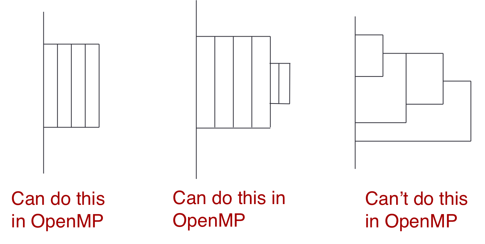

template: titleslide
# C++ Threads – Further topics

---
# Overview

- `std::async` and futures
- Parallel STL
- C++ threads or OpenMP?

---
# async and futures

- With `std::thread` there is no direct way to get a return value from the function/lambda that a thread executes

- Could alter function to use an output reference argument, but this is problematic

- Can get round this with `std::async` and futures

- Also allows exception handling to work properly if a thread throws an exception

- async returns a future object, and calling the `get()` function on the future blocks until the value is available

---
# async and future

```C++
int add(int x, int y) {
	 return x+y;
}

int main() {
  int a = 1;
  int b = 27;
  std::future<int> fut = std::async(add, a, b);
  cout << "sum  = " << fut.get() << std::endl;
}
```

---
# async and future

```C++
int add(int x, int y) {
	 return x+y;
}

int main() {
  int a = 1;
  int b = 27;
  auto fut = std::async(add, a, b);
  cout << "sum  = " << fut.get() << std::endl;
}
```

---
# Problems!

- By default, the runtime can decide to not create a new thread to run
  the callable, and simply execute it when `fut.get()` is called.

- Can cause deadlock if you are not careful!

- Can force asynchronous execution via an optional policy argument:
```C++
auto fut = std::async(std::launch::async, add, a, b);
```

- Implementations can choose to use a thread pool to execute asyncs,
  but most don’t can end up with way too many threads

---
# Parallel STL

- Version of the STL that incorporates parallel versions of many STL algorithms

- Part of C++17 standard, so not yet available in most standard
  library implementations, but coming soon.

- Most STL algorithms take a addition execution policy argument: 
   * Sequential
   * Parallel
   * Parallel and vectorized
   * (vectorized but not parallel added in C++20)

---
# Example

```C++
std::vector<int> v = genLargeVector(); 

// standard sequential sort 
std::sort(v.begin(), v.end()); 

// explicitly sequential 
sort std::sort(std::execution::seq, v.begin(), v.end()); 

// permitting parallel execution 
std::sort(std::execution::par, v.begin(), v.end()); 

// permitting vectorization as well 
std::sort(std::execution::par_unseq, v.begin(), v.end());
```

---
# Easy to use, but...

- For algorithms that take a function object argument (e.g.
  `for_each`), that operates on each element it is up to the
  programmer to ensure that parallel/vectorized execution of this is
  correct.

- Interface gives almost no control to the programmer
   * how many threads to use?
   * which threads handle which elements?
   * whether to use a static of dynamic assignment of work to threads?

- Might be difficult to have any control over data affinity/locality

- Implementations can support additional execution policies

- Scope for adding more to the standard in the future

---
# C++ threads or OpenMP?

- Since OpenMP supports C++ as a base language, what are the pros and cons of OpenMP vs C++ threads?

- Adding OpenMP support for new C++ features takes time (several years
  in practice)

- OpenMP 4.5 only supports C++98

- OpenMP 5.0 supports most of C++11/14

  * some exceptions – including C++ threads and atomics
  * implementations will take some time to catch up with this

- If you want to use the latest and greatest features in C++, then
  OpenMP might not work.

---
# C++ threads or OpenMP?

OpenMP has a lot of useful features that are not available in the C++ standard: 

- Thread barriers
  * will likely be added in C++20

- Thread pools and tasks
  * may be added in C++23 (depends on "executors")

- Parallel for loops
  * some functionality with `std::for_each` in Parallel STL

- SIMD directives
  * probably will work OK with C++ threads

---
# But I can build my own!

- C++ threads has all the required building blocks to allow you to
  implement many of these features for yourself

  * or borrow someone else’s implementation

- Can make use of C++ functionality to make them look syntactically neat

- May not be correct 
  * low level threaded programming is hard!

- May not be well documented
  * unusual to find documentation that is as good as language standards

- Unlikely to be both portable and efficient 
  maximum efficiency typically requires architecture-specific coding

---
# What about GPUs?

- OpenMP has support for offloading code to GPUs

  * still a bit immature, not many good implementations yet

- C++ may support this in the future sometime?? 

- There are a number of C++ frameworks for doing this

  * Kokkos
  * Raja
  * SYCL

- Various degrees of support and robustness

---
# More differences

- OpenMP has some restrictions which annoy C++ programmers

  * e.g. can’t use data members of objects in private or reduction clauses

- Support for reductions is in both, but handled differently

  * OpenMP allows you to define your own reduction operators
  * C++ has `std::reduce` in the Parallel STL

- OpenMP does not allow arbitrary forking/joining of threads
  * You can argue whether this is a good thing or not in an HPC context!

- C++ has no standard way of binding threads to sockets/cores
  * need to call OS-specific functions 

---
# C++ threads or OpenMP?
.center[

]

---
# Reusing this material

.center[]

This work is licensed under a Creative Commons Attribution-NonCommercial-ShareAlike 4.0 International License.

https://creativecommons.org/licenses/by-nc-sa/4.0/

.smaller[
This means you are free to copy and redistribute the material and adapt and build on the material under the following terms: You must give appropriate credit, provide a link to the license and indicate if changes were made. If you adapt or build on the material you must distribute your work under the same license as the original.

Acknowledge EPCC as follows: “© EPCC, The University of Edinburgh, www.epcc.ed.ac.uk”

Note that this presentation may contain images owned by others. Please seek their permission before reusing these images.
]
